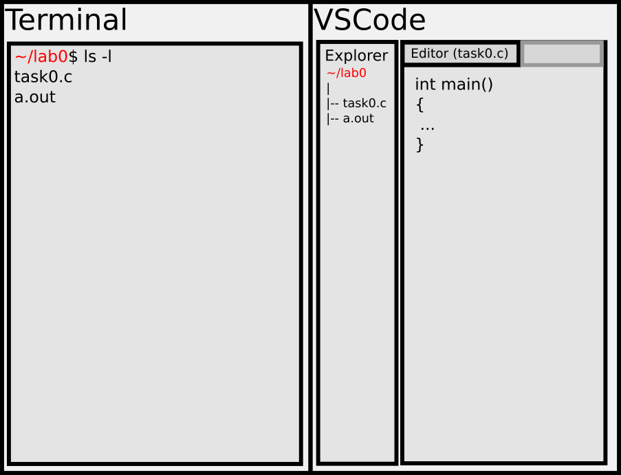

# Labor 0 

Diese einführende Laboreinheit dient dazu, 

- Sie mit der Entwicklungsumgebung (Terminal und Editor) im Labor vertraut zu machen, 
- die TUWEL-Abgabe zu üben, und
- Ihnen die Möglichkeit zu bieten, Fragen zum eigenen System (Laptop/Desktop) und dessen Konfiguration zu stellen.

Zeitlich ist die heutige Laboreinheit (120min) in 3 Teile aufgeteilt, die jeder Studierende auch in der gegebenen Reihenfolge zu absolvieren hat (es gibt keine Zeitvorgaben für die einzelnen Teile):

**1. Teil**: Sie üben selbständig das Arbeiten im Labor (Terminal-Befehle und Datei-Editor). Sie können jederzeit Fragen stellen. Ziel ist es, dass Sie die im **2. Teil** vorgegebenen Arbeitsschritte ohne Hilfe demonstrieren können.
Sobald Sie sich in der Lage fühlen, diese Arbeitsschritte zu demonstrieren, rufen Sie bitte einen Betreuer zu Ihrem Arbeitsplatz.

**2. Teil**: Sie demonstrieren unter Beisein des Betreuers Ihre Fähigkeit, die vorgegebenen Arbeitsschritte selbständig auszuführen. Nach erfolgreicher Demonstration können Sie zum **3. Teil** übergehen.

**3. Teil**: Hier bieten wir Ihnen die Möglichkeit, Fragen zur Konfiguration Ihres eigenen Systems zu stellen.

***
***

# 1. Teil: Arbeiten im Labor

Alle Rechner im Labor haben identische Konfiguration (OpenSUSE-Linux). 
Sie können sich mit Ihren Zugangsdaten einloggen:

- Benutzername: Bitte auswählen!
- Passwort: Ihre Matrikelnummer (8-stellig)

Sie benötigen zum Arbeiten im Labor:
- das Terminal (bash), 
- den Editor (VSCode), und
- den Internetbrowser (Chromium).


## Navigation im Terminal 

Eine Terminal-Session ist **immer** einem aktueller Ordner (bzw. Verzeichnis) zugeordnet.
Sie können durch Navigationsbefehle in ein anderes Verzeichnis wechseln.
Das aktuelle Verzeichnis (current working directory, CWD) kann jederzeit mit dem Befehl `pwd` (print working directory) ausgegeben werden.

Jeder Benutzer besitzt ein Heimverzeichnis (**Home Directory**), in dem er Lese- und Schreibrechte besitzt.
Sie können jederzeit in dieses *home* wechseln:
```shell
cd ~    # changes directory to the user's home folder
``` 
Nach diesem Befehl ist das Arbeitsverzeichnis der Terminal-Session der *home folder* Ihres Benutzers.
Sie können sich dann zur Übersicht ausgeben lassen, wo sich dieses *home* genau befindet:
```shell
pwd     # prints full path of current working directory (CWD)
``` 
Mit dem Befehl `ls` können Sie Sich einen Überblick über die Ordner und Dateien in einem Verzeichnis schaffen:
```shell
ls .   # prints contents of CWD
ls ./  # prints contents of CWD
ls ~   # prints contents of user's home folder
ls /   # prints contents of root folder on this machine
``` 

Mit dem Befehl `cd` können Sie in der Ordnerstruktur navigieren:

```shell
cd ~              # change to user's home folder 
cd Downloads/     # move into folder 'CWD/Downloads/'
cd ../            # move one hierarchy "up" from the CWD
```

## Absolute und relative Pfade

Bei Pfadangaben ist es wichtig zwischen relativen und absoluten Pfaden zu unterscheiden:

- Pfadangaben die mit `/` beginnen werden als absolute Pfade interpretiert.
- Pfadangaben die mit `.` oder `./` oder direkt mit einem Namen, z.B. `lab0` beginnen, werden als relative Pfade interpreriert. 

Beispiel: `ls`

```shell
ls ./                             # --> relative path 
ls .                              # --> relative path
ls ./Downloads/                   # --> relative path    
ls Downloads/                     # --> relative path    
ls /laborusers/progXXX/Downloads/ # --> absolute path  
```

Beispiel: `cd`

```shell
cd /laborusers/progXXX/  # --> absolute path
cd Downloads/            # --> relative path
cd ../                   # --> relative path
```

Wie schon oben gesehen können Sie Ihr Heimverzeichnis mit `~` ansprechen und auch mit weiteren Pfadangaben kombinieren:
```shell
cd ~/Downloads       # --> absolute path
ls ~/Downloads       # --> absolute path
```


## Eigene Ordnerstruktur

Wie Sie bemerkt haben, ist Ihr *home folder* nicht leer. Es macht also organisatorisch Sinn, dass Sie sich einen neuen Ordner anlegen, und für jede Laboreinheit nur "innerhalb" dieses neuen Ordners arbeiten:
```shell
cd ~          # changes to home folder 
mkdir lab0    # creates a new folder 'lab0' 
cd lab0/      # changes into 'lab0' folder 
ls .          # prints 'lab0' folder
```
Neu dabei war der Befehl `mkdir`, der ein Verzeichnis mit dem angebebenen Namen erstellt.

## Eigene Dateien

Sie können sich leere Dateien mit dem Befehl `touch` anlegen:
```shell
cd ~/lab0/      # moves into 'lab0' folder 
touch empty.c   # creates an empty file named 'empty.c' 
```
Um Ihre Befehle besser nachvollziehen zu können, führen wir noch einen weiteren Befehl ein:
```shell
echo "// task0" > task0.c
```
Diese Befehlskombination erzeugt eine Datei `task0.c` mit dem einzeiligen Inhalt:
```c
// task0
```
Sie können sich diesen Inhalt mit dem Befehl `cat` im Terminal ausgeben lassen:
```shell
cat task0.c     # prints content of 'task0.c'
cat empty.c     # prints content of 'empty.c'
```

Sie können Dateien mit dem Befehl `rm` auch wieder löschen:
```shell
rm empty.c      # removes the file 'empty.c'
```

## Kompilieren

Sie können eine C-Quelldatei mit dem `gcc`-Compiler kompilieren:
```shell
gcc task0.c     # tries to compile 'task0.c'
```
Natürlich schlägt das Kompilieren mit dem 'task0.c' fehl (`main`-Funktion fehlt), aber Sie sollten im Terminal die Fehlermeldungen des Compilers sehen können.
 
## Editor
Um Quelldateien zu editieren, brauchen Sie einen Editor.  
Im Labor verwenden wir VSCode als Editor für Quelldateien (aber nicht als volle IDE).
Sie können VSCode aus dem Terminal heraus öffnen:
```shell
cd ~/lab0/  # move to 'lab0' folder
code .      # open VSCode for current folder
```
Sie können nun alle Unterverzeichnisse und Dateien im `lab0` Ordner in VSCode editieren und speichern.

Benutzen Sie nun die Tastenkombinationen

- `STRG`+`C` (Kopieren von markiertem Text) und 
- `STRG`+`V` (Einfügen von vorher kopiertem Text)

um untenstehenden Quellcode in eine Quelldatei `task0.c` zu kopieren, die Sie in VSCode geöffnet haben:
```c
#include <stdio.h>
int main()
{
    printf("task0\n");
}
```
Speichern Sie die Änderungen in VSCode ab (Tastenkombination `STRG`+`S`) und kompilieren Sie das Programm aus dem Terminal:
```shell
gcc task0.c     # compile task0.c
ls              # check if program was compiled ('a.out')
```
**Hinweis**: `gcc` wählt als Namen für die erzeugte ausfühbare Datei `a.out`, falls nicht anders angegeben. Auf Unix-Systemen gibt es keine Vorgabe für die Dateiendung von ausführbaren Programmen (z.B. `.exe`).

Sie sollten nun in der Lage sein, das Programm aufzurufen:
```shell
./a.out         # call executable 'a.out'
```
Im Terminal sollten Sie nun `task0` ausgebenen werden.

## Bilschirmaufteilung
Wir empfehlen den Bildschirm so aufzuteilen:




# 2. Teil: Demonstration
Rufen Sie einen Betreuer zu Ihrem Arbeitsplatz und demonstieren Sie ihm die selbständige Ausführung folgender Arbeitschritte:

0. Schliessen Sie alle offenen Fenster (außer diese Anleitung).
1. Öffnen Sie ein Terminal.
2. Terminal: Navigieren Sie in Ihr Heimatverzeichnis.
    - Befehl: `cd ~`
3. Terminal: Erstellen Sie einen neuen Ordner, der als name die aktuelle Uhrzeit im Format HHMM (also z.B. `1545`) enthält und wechseln Sie in diese Ordner.
    - Befehl: `mkdir HHMM`
    - Befehl: `cd HHMM`
4. Terminal: Erstellen Sie innerhalb dieses neuen Ordners eine leere Quelldatei `main.c`.
    - Befehl: `touch main.c`
5. Terminal: Lassen Sie sich im Terminal die Dateien und Ordner im Arbeitsverzeichnis ausgeben.
    - Befehl: `ls .`
5. Terminal: Öffnen Sie VSCode aus dem Terminal heraus für das aktuelle Arbeitsverzeichnis.
    - Befehl: `code .`
6. VSCode: Kopieren Sie folgenden Quellcode in die Datei `main.c` :
    ```c
    #include <stdio.h>
    int main()
    {
        printf("TODO\n");
    }
    ```
    - Speichern Sie die Änderungen an der Datei in VSCode (Tastenkombination `STRG`+`S`) 
7. Terminal: Kompilieren Sie die Datei `main.c`.
    - Befehl: `gcc main.c`
8. Terminal: Führen Sie das erzeugte Programm aus.
    - Befehl: `./a.out`
9. Provozieren Sie einen Kompilierfehler:
    - VSCode: ändern Sie die Datei so ab, dass Sie ungültige Syntax oder Semantik enthält.
    - Terminal: Kompilieren Sie die Datei erneut (`gcc main.c`).
10. Beheben Sie den Kompilierfehler:
    - VSCode: Korrigieren Sie den Fehler wieder; danach Speichern.
    - Terminal: Kompilieren Sie die Datei erneut (`gcc main.c`).
    - Terminal: Führen Sie das erzeugte Programm aus (`./a.out`).
11. Programm anpassen:
    - VSCode: Ändern Sie den Ausgabetext des Programms zu `Hallo Labor!` .
    - Terminal: Kompilieren Sie die Datei erneut (`gcc main.c`).   
    - Terminal: Führen Sie das erzeugte Programm aus (`./a.out`).      
12. TUWEL: Öffnen Sie die TUWEL-Seite des Kurses im Browser und lösen Sie die Aufgabenstellung unter "**Hausübung 0 (2. Teil der Abgabe)**" einschließlich Abgabe über TUWEL.


# 3. Teil: Setup eigenes System
Sobald Sie den **2. Teil** erfolgreich demonstiert haben, können Sie nun Fragen zur Konfiguration Ihres eigenen Systems stellen.
Falls bei der Konfiguration Ihres Systems Probleme aufgetreten sind, machen Sie uns bitte darauf aufmerksam.
Falls Sie Ihr eigenes System mitgebracht haben, können Sie uns gerne konkret Probleme demonstieren oder weitergehende Fragen zur Konfiguration stellen.

