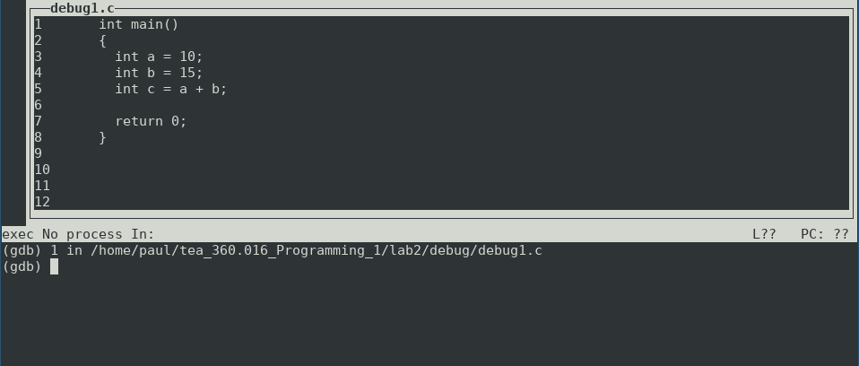

# Labor 2

Zeitlich ist die heutige Laboreinheit in 2 Teile aufgeteilt:

**1. Teil** (30min): Ausarbeitung von 2 Programmieraufgaben (Angaben und Abgaben über TUWEL). Ihre Lösungen werden im Nachgang bewertet.

**2. Teil** (90min): Sie erarbeiten sich selbstängig (Diskussionen unter Studierenden sind erlaubt und erwünscht) die vorgegeben Aufgabenstellungen. Sie können jederzeit Fragen stellen. Ziel ist es, dass Sie die unter **Demonstration** vorgegebenen Arbeitschritte und Aufgaben lösen.
Sobald Sie sich in der Lage fühlen, diese Arbeitschritte und Aufgaben zu demonstrieren, rufen Sie bitte einen Betreuer zu Ihrem Arbeitsplatz.


---

# 1. Teil (30min): Bewertete Programmieraufgaben

 **Aufgabenstellung über TUWEL:**

`Hausübung 2 (2. Teil der Abgabe)`

# 2. Teil (90min): Labor mit den Schwerpunkten Debugging und Zeiger

**Hinweis**: Wir empfehlen immer mit folgenden Einstellungen zu kompilieren:
```shell
gcc -g -fsanitize=address -Wall -Werror -pedantic -std=c11 XXX.c && ./a.out
```

**Fragen fragen:** Nutzen Sie die Gelegenheit bei den Laborterminen bitte auch um jegliche Art von Fragen im Hinblick auf das Programmieren in C oder auch allgemeinerer Art zu stellen!


# Demonstration

0. Laden Sie sich diese Angabe (samt Quelldateien) als `.zip`-Datei herunter und entpacken Sie diese.

1. **Debugging**

    Kompileren Sie die Datei `debug/debug3.c` mit Debug-Symbolen und führen Sie unten beschriebene Debugging-Aufgaben durch:
    ```shell
    gcc -g debug3.c && gdb -tui ./a.out    # compile with debug symbols and run gdb in tui mode
    ```
    - **Debugging-Aufgabe 1**: Setzen eines Haltepunkts am Anfang der Funktion `add` und Debuggen des Ablaufs der Funktion `add` inklusive Ausgabe der Funktionsargumente und lokalen Variablen.
    - **Debugging-Aufgabe 2**: Setzen eines Haltepunkts innerhalb der `for`-Schleife und Debuggen der Iterationen der `for`-Schleife inklusive Ausgabe der lokalen Variablen in jeder Iteration.

2. ***Pass-by-Reference* (Zeiger-Argumente)**

    In `pointers/task1.c` ist ein Programm gegeben, dass mit einer *swap* Funktion zwei Werte in einem Array vertauscht:
    ```c
    void swap_using_indices(int array[], int i, int j);
    ```
    Implementieren Sie zusätzlich die Funktion
    ```c
    void swap_using_pointers(int *a, int *b);
    ```
    um zwei `int`-Werte zu vertauschen, die mittels Zeiger übergeben werden.
    Schreiben Sie dann die `main`-Funktion so um, dass `swap_using_pointers` anstelle von `swap_using_indices` aufgerufen wird, jedoch der gleiche Effekt erreicht wird (das erste und letzte Element von `array` werde vertauscht).

3. **Zeiger Arithmetik**

    In `pointers/task2.c` finden Sie ein Programm, das einen Teilbereich eines Arrays mit einem Wert initialisiert. 
    Es werden zwei Funktionen für diese Aufgabe bereitgestellt und auch aufgerufen:
    ```c
    void init_range_using_indices(double array[], int begin, int end, double value);
    void init_range_using_pointers(double *begin, double *end, double value);
    ```
    Diskutieren Sie mir Ihren Sitznachbarn wie die Argumente der zwei Funktionen zu interpretieren sind, und wie die beiden Funktionen "funktionieren". 
    Fügen Sie dann in der Quelldatei Kommentare für beide Funktionen hinzu, die **jedes** der Argumente kurz aber präzise charakterisieren; dass soll dann ungefähr so aussehen:
    ```c
    // 'value': Der Wert mit dem der Bereich des Arrays initialisiert wird
    void init_range_using_indices(double array[], int begin, int end, double value);
    ```
4. **Funktionszeiger**

   In `pointers/task3.c` sind 3 Implementierungen gegeben, die zählen, wie oft ein Wert größer 10.0 in einem Array vorkommt:
   ```c
   int count_if_greater_10(double array[], int size);             // 1. fixed comparison / fixed value
   int count_if_greater(double array[], int size, double value);  // 2. fixed comparison / value as argument       
   int count_if(double array[], int size, int (*pred)(double));   // 3a. unary predicate function as argument     
   int predicate_greater_10(double value);                        // 3b. unary predicate, returns true if value > 10, else false
   ```
   
   Diskutieren Sie mit Ihren Sitznachbarn, wie es um den Implementierungsaufwand steht wenn

   - viele weitere Bedingungen/Prädikate implementiert werden müssten, oder
   - wenn die Implementierung um die Möglichkeit erweitert werden soll, nur einen Teilbereich des Arrays zu durchsuchen.

   Notieren Sie sich kurz als Kommentare in `pointers/task3.c` welche Hauptargumente Sie erörtert haben.
  

# Hilfestellungen zum Lösen der Demonstrationsaufgaben

## Debugging

Normalerweise wird ein kompiliertes Programm ohne "Pausen" ausgeführt: für den Aufrufenden gibt es dabei keine Möglichkeit die Werte bestimmter Variablen einzusehen oder Funktionsaufrufe im Detail zu verfolgen, es sei denn, Werte und Informationen über den Programmablauf werden in der Konsole ausgegeben oder in Dateien geschrieben (z.B. *Logging* mit `printf`). 

Zur Lokalisierung eines Fehlers --  aber durchaus auch beim Erlernen einer Sprache -- kann es sehr hilfreich sein ein Programm Schritt-für-Schritt ablaufen zu lassen, 
um sich Variablenwerte und Funktionsargumente ausgeben zu lassen, oder um Verzweigungen und Funktionsaufrufe zu analysieren.
Dies ist mit einem *Debugger* möglich falls das Programm mit *Debug-Symbolen* kompiliert wurde: diese Symbole dienen dazu einen Bezug zwischend den einzelnen Maschinenbefehlen und den entsprechenden Stellen/Variablen im Quellcode zu erhalten.

Wir verwenden im Rahmen der LVA `gdb`, den *GNU Debugger* aus dem Terminal heraus. 

### Einfaches Beispiel: `debug/debug1.c`

1. Programm mit Debug-Symbolen kompilieren:
    ```c
    gcc -g debug1.c 
    ```
2. Programm mit `gdb` im `tui`-Modus aufrufen:
    ```c
    gdb -tui ./a.out
    ```
    Das sieht dann ungefähr so aus:

    
    
    **Wichtig:** Sie befinden Sich ab diesem Zeitpunkt im Terminal des `gdb`, es gelten also nicht die Befehle des Linux-Terminals, sondern nur die Befehle des `gdb`.
3. Grundlegende Befehle

    Die Befehlsvielfalt ist groß (offizielle Handbuch: https://sourceware.org/gdb/current/onlinedocs/gdb/) wir benötigen aber nur grundlegende Befehle:

    1. Das Programm starten (startet das Programm und hält die Ausführung beim Eintritt in die `main`-Funktion an):
        ```shell
        (gdb) start
        ```
    2. Alle lokalen Variablen mit Werten ausgeben:
        ```shell
        (gdb) info locals
        ```        
    3. Die aktuelle Zeile Ausführen und dann wieder warten (***n**ext*):
        ```shell
        (gdb) n
        ```
    4. Ausführen bis zum nächsten *Haltepunkt*  oder Ende des Programms (***c**ontinue*):
        ```shell
        (gdb) c
        ```
    5. `gdb` beenden (***q**uit*):
        ```shell
        (gdb) q
        ```

### Zweites Beispiel mit einer Funktion: `debug/debug2.c`

1. Programm mit Debug-Symbolen kompilieren und mit `gdb` starten:
    ```c
    gcc -g debug2.c && gdb -tui ./a.out
    ```
2. Das Programm starten (startet das Programm und hält die Ausführung beim Eintritt in die `main`-Funktion an):
    ```shell
    (gdb) start
    ```
3. Die aktuelle Zeile Ausführen und dann wieder warten (***n**ext*):
    ```shell
    (gdb) n
    ```
4.  Die aktuelle Zeile Ausführen und falls ein Funktionaufruf vorkommt diesem folgen (***s**tep*), z.B. in `debug2.c:11` und `debug2.c:12` :
    ```shell
    (gdb) s
    ```    
5.  Argumente der Aktuellen Funktion ausgeben:
    ```shell
    (gdb) info args
    ```       
6.  Aktuellen Funktiosaufruf fertig ausführen und zurück zur aufrufenden Zeile springen:
    ```shell
    (gdb) finish
    ```    
7. `gdb` beenden (***q**uit*):
    ```shell
    (gdb) q
    ```

### Haltepunkte:

Bei umfangreicheren Programmen (viele Dateien, viele Zeilen) ist es hilfreich Haltepunkte zu setzen, um isoliert einen Teil des Programmablaufs analysieren zu können:
```shell
(gdb) break debug2.c:3              # adds breakpoint in debug2.c line 3
(gdb) break add                     # adds breakpoint at entry of 'add' function
(gdb) break main                    # adds breakpoint at entry of 'main' function
(gdb) break debug3.c:27 if i>=3     # adds breakpoint in debug2.c line 3 if variable i has value 3 or larger
```

### Einzelne Variablen ausgeben oder beobachten:

- Die Variable `a` ausgeben 
    ```shell
    (gdb) print a
    ```
- Die Variable `a` beobachten und bei jeder Zustandsänderungen anhalten 
    ```shell
    (gdb) watch a
    ```    

### Programmschritte Aufzeichnen und Rückgängig machen:

- Die Aufzeichnung von Änderungen starten:
    ```shell
    (gdb) start
    (gdb) record
    ```
- Einen Schritt zurück (***r**everse-**n**ext*):
    ```shell
    (gdb) rn
    ```     
- Einen Schritt zurück (***r**everse-**s**tep*):
    ```shell
    (gdb) rs
    ```    
- Zurück bis zum vorherigen Haltepunkte (***r**everse-**c**ontinue*):
    ```shell
    (gdb) rc
    ```    


### Installation Ubuntu/WSL
```shell
sudo apt-get install build-essential # includes the 'gdb' debugger
```
### Installation MacOS
Auf MacOS empfehlen wir mit dem `lldb` Debugger (Standard auf MacOS) zu arbeiten.

Die Befehle unterscheiden sich leicht zwischen `gdb` und `lldb`:
https://lldb.llvm.org/use/map.html 
```shell
sudo xcode-select --install     # includes the 'lldb' debugger
```

